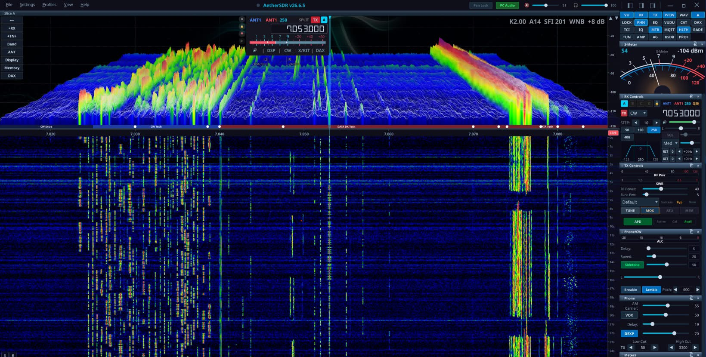

# AetherSDR

**A cross-platform, open-source client for FlexRadio Systems transceivers**

[](https://github.com/aethersdr/AetherSDR/actions/workflows/ci.yml)
[](https://www.gnu.org/licenses/gpl-3.0)
[](https://en.cppreference.com/w/cpp/20)
[](https://www.qt.io/)
[](https://github.com/aethersdr/AetherSDR/commits/main)

AetherSDR brings full FlexRadio operation to Linux, macOS, and Windows — each a native build, no Wine or virtual machines. A native aarch64 build also runs on Raspberry Pi and other embedded ARM devices. Built from the ground up with Qt6 and C++20, it speaks the SmartSDR protocol natively and aims to replicate the full SmartSDR experience.

**Current version: 26.9.4** — CalVer (`YY.M.patch[.hotfix]`). | [Download](https://github.com/aethersdr/AetherSDR/releases/latest) | [Discussions](https://github.com/aethersdr/AetherSDR/discussions) | [What's New](https://github.com/aethersdr/AetherSDR/releases)

> **Native builds for Linux, macOS, and Windows** — Linux AppImage (x86-64 + aarch64), macOS DMG (Apple Silicon + Intel), Windows installer and portable ZIP. Every platform is built, tested in CI, and released together.



<p><i>Native. Open. Yours.</i></p>

---

## Highlights

- **GPU-accelerated spectrum & waterfall** — QRhi rendering (OpenGL/Metal/D3D11) with a per-pixel FFT trace at up to **60 fps**, an optional **3D stacked-trace** mode, ~71% less CPU than the paint path, GPU-composited slice flags and multi-GPU adapter selection
- **Multi-slice & multi-panadapter** — colour-coded VFO overlays, independent TX assignment, diversity/ESC beamforming, and up to 8 detachable pans with native VITA-49 waterfall tiles and per-flag S-meter / **SmartMTR** views
- **KiwiSDR and Web-888 public-receiver browser** — find and connect to public receivers worldwide through an API-policy-aware directory, with diversity receive and receive-only TX inhibit
- **AetherTX and AetherRX** — the transmit and receive chains, one window each. AetherTX is the channel strip (gate, EQ, compressor, de-esser, tube, AetherVoice exciter, reverb, brickwall limiter) with a preset library and scope; AetherRX puts noise reduction, gate, EQ, compressor, tube, AetherVoice and the output meter on tabs down its left edge
- **Seven client-side noise-reduction engines** — NR2 (spectral), RN2 (RNNoise), NR4 (libspecbleach), NNR (WDSP's Neural Noise Reduction), DFNR (DeepFilterNet3), BNR (the NVIDIA Maxine denoiser, in-process on a local RTX/GeForce GPU, Linux + Windows — [`docs/nvidia-bnr.md`](docs/nvidia-bnr.md)) and MNR (macOS)
- **DAX virtual audio + IQ** — up to 8 RX audio channels (radio-dependent) plus 1 TX, and 4 channels of raw I/Q at 24–192 kHz for WSJT-X / fldigi / VARA / JS8Call, with a per-slice **WFM demodulator** for satellite data
- **AetherModem packet radio** — KISS-over-TCP TNC, connected-mode AX.25 BBS, a personal mailbox, a WIDE1-1 fill-in digipeater, and an **APRS client** (station map, GPS beacon, messaging) on a Direwolf-derived VHF demodulator
- **AetherSweep** — in-panadapter SWR analyzer with log scale, threshold-band shading and interpolated bandwidth at SWR ≤ 1.5 / 2.0
- **SpotHub** — DX Cluster, RBN, WSJT-X, POTA, FreeDV Reporter, N1MM+/DXLog contest bandmap, the EiBi shortwave schedule and the KiwiSDR DX Community database, with auto-mode switch and per-feed colouring
- **CW operator suite** — real-time Morse decoder, MIDI/keyboard straight-key and iambic paddles with full QSK, optional Quindar tones
- **Copy Assist (speech-to-text)** — on-device transcription of received voice via whisper.cpp, docked under the waterfall with confidence colour-coding. CPU or GPU (Vulkan/Metal, auto-detected), download-on-demand models, optional remote OpenAI-compatible endpoint. Not in the Intel macOS build — see [`docs/asr-copy-assist.md`](docs/asr-copy-assist.md)
- **FreeDV RADE** — AI digital-voice codec with a client-side neural encoder/decoder
- **PSK Reporter map overlays** — optional global precipitation (LibreWXR, with NOAA, ECCC and EUMETNET OPERA regional radar backups and a per-provider legend), NOAA/NWS weather radar with observation playback ([`docs`](docs/psk-reporter-weather-radar.md)) and a NASA/GSFC VIIRS night-lights layer that fades through civil twilight ([`docs`](docs/psk-reporter-city-lights.md)), on both the 2D map and 3D globe
- **SmartLink remote + TCI v2.0 server** — Auth0/TLS WAN operation, and CAT + audio + IQ + CW + spots over a single TCI WebSocket
- **Broad hardware control** — rigctld and virtual-serial CAT, MIDI mapping, the FlexControl knob, serial PTT/CW keying, and Multi-Flex operation alongside SmartSDR/Maestro
- **Workspace canvas** — place pans and applets freely as resizable, layered items with edge and grid snapping, across several windows if you want them. Named workspaces recall which applets are open as well as where they sit, and bind to radio profiles. Off by default; the Classic shell is unchanged until you enable it
- **Built-in demo mode** — a synthetic backend generating its own RX audio and matching panadapter, with a fault-injection harness, so you can explore the full UI with no radio attached (it cannot transmit)

---

## How AetherSDR Is Built

AetherSDR is developed through an AI-augmented open-source workflow. The project
lead (Jeremy KK7GWY) and a core contributor team work primarily through Claude
Code; contributors use a mix of AI tools (Codex, Copilot, Cursor, Gemini,
Aider); and the [AetherClaude](https://github.com/aethersdr/aetherclaude)
orchestrator bot triages incoming issues, drafts implementation plans and opens
PRs for anything labelled `aetherclaude-eligible`.

Every change passes the same gate regardless of which tool — or human — produced
it: branch protection enforces signed commits, green CI and CODEOWNERS review,
and nothing reaches `main` without human review. The project's
[Constitution](CONSTITUTION.md) (14 principles, structured per [Cisco's Foundry
Constitution](https://github.com/CiscoDevNet/foundry-security-spec) spec)
codifies the conventions every contributor and every AI tool follows, and
[`AGENTS.md`](AGENTS.md) is the canonical guide each assistant reads first.

At active pace that is roughly 50 PRs a week across six or more distinct AI
tools. The full contributor list is auto-generated from commit attribution — see
the [Contributors graph](https://github.com/aethersdr/AetherSDR/graphs/contributors).

---

## Supported Hardware

Works with any FlexRadio transceiver, including:

- FLEX-6000 series: FLEX-6300, FLEX-6400, FLEX-6400M, FLEX-6500, FLEX-6600, FLEX-6600M, FLEX-6700
- FLEX-8000 series: FLEX-8400, FLEX-8400M, FLEX-8600, FLEX-8600M
- Aurora series: AU-510, AU-510M, AU-520, AU-520M
- ML-, CL-, and RT-series devices

Supported external devices include the 4O3A/FlexRadio PGXL (Power Genius XL)
power amplifier and TGXL (Tuner Genius XL) antenna tuner, and — outside the
radio seam entirely — ACOM S-series and SPE Expert (1.3K-FA / 1.5K-FA / 2K-FA)
amplifiers over serial or ser2net TCP, and VK3AMP (600 W / 1000 W / 2000 W)
amplifiers over TCP control with UDP telemetry.

Active test target is FLEX-8600 firmware 4.2.18 (SmartSDR protocol v1.4.0.0);
earlier 4.x firmware works; v3.x is unsupported.

**Other radio families** ride the vendor-neutral `IRadioBackend` seam. Neither
is a supported family yet, and FlexRadio remains the supported target:

- **Hermes-Lite 2** — **experimental**. Four independent receivers, SSB voice
  through WDSP's TXA modulator with a reduction-only ALC, CW/RTTY decoding,
  AX.25 packet, band switching with hardware filters, manual notch filters, a
  host-side impulse noise blanker, host frequency calibration, a derived dBm
  reference, an on-demand wideband bandscope and per-radio state restore
  (including AGC mode and threshold).
- **Networked Icom** — **early**. CI-V over the RS-BA1 UDP transport, brought up
  on the IC-705 (receive, scope, transmit, FT8) and completed against a live
  IC-7300MK2 (controls, meters, ATU, WSPR, PC Audio routing and the CW decoder).
  The connect path asks the radio for its own CI-V address rather than assuming
  one. Only the IC-705 and IC-7300MK2 are verified against their own CI-V guides
  — an unrecognised model gets no scope and no transmit rather than optimistic
  defaults.
- **ANAN-G2** — **experimental, receive-only**. openHPSDR Protocol 2 discovery
  with a single receive path, spectrum and audio, live tuning and zoom, live DDC
  rate changes, and DDC0 edge-droop compensation derived from the Saturn
  gateware (an in-app calibration can override it). Transmit is a future phase.
- **RTL-SDR** — **experimental, receive-only**. Discovers supported USB dongles
  through `librtlsdr` and provides one panadapter and one host-demodulated slice.

No radio at all? **Demo mode** runs the full UI against a synthetic backend
that generates its own audio and spectrum.

## Tested Controller Devices

AetherSDR supports external station-control hardware through USB serial, USB HID,
MIDI, and generic USB-serial adapters:

- FlexRadio FlexControl USB tuning knob
- Icom RC-28 USB remote encoder
- Griffin PowerMate USB knob
- Contour ShuttleXpress and ShuttlePro v2 jog controllers
- MIDI controllers with learn mode, manual mapping entry, importable/exportable profiles (including vendor-supplied SmartSDR `.map` files), and relative-encoder support
- Elgato Stream Deck+ natively over USB HID (hidapi builds), driving the LCD keys and the four encoder dials
- Other Stream Deck models, on any platform, through the TCI server or the automation bridge using the control-surface software of your choice — AetherSDR provides the protocol, not the button layer
- USB-serial PTT/CW interfaces for foot switches, straight keys, iambic paddles,
  amplifier keying lines, and external sequencers

---

## Download

Pre-built binaries are available from [Releases](https://github.com/aethersdr/AetherSDR/releases/latest):

| Platform | Download | Notes |
|----------|----------|-------|
| **Linux x86_64** | `AetherSDR-*-x86_64.AppImage` | Single file, no install needed. `chmod +x` and run. |
| **Linux ARM** | `AetherSDR-*-aarch64.AppImage` | Raspberry Pi, ARM laptops. `chmod +x` and run. |
| **macOS** | `AetherSDR-*-macOS-apple-silicon.dmg` | Apple Silicon (M1+). Intel Macs via Rosetta. Signed & notarized. |
| **Windows Installer** | `AetherSDR-*-Windows-x64-setup.exe` | Setup wizard with Start Menu shortcut and uninstaller. |
| **Windows Portable** | `AetherSDR-*-Windows-x64-portable.zip` | No install needed. Extract and run. |

---

## Building from Source

**Qt 6.8 or newer is required** — that is the source floor. Release binaries
are built against Qt 6.12.0 LTS, so what CI compiles is what ships. Distro Qt
clears this on Debian Trixie, Ubuntu 25.10+, Fedora 41+ and Arch. It does
**not** clear on
Ubuntu 24.04 LTS (6.4.2), and on macOS Qt does not come from Homebrew at all —
both cases are covered in [`docs/BUILDING.md`](docs/BUILDING.md).

### Dependencies

Optional packages are noted in the build docs; the build succeeds without them
with the corresponding features disabled.

```bash
# Arch / CachyOS / Manjaro
sudo pacman -S qt6-base qt6-multimedia qt6-websockets qt6-serialport \
  qt6-shadertools cmake ninja pkgconf autoconf automake libtool \
  fftw rtl-sdr portaudio hidapi qtkeychain-qt6

# Debian Trixie / Ubuntu 25.10+ / Linux Mint 23+
# (Ubuntu 24.04's Qt is 6.4.2 — below the floor; see the note above.)
sudo apt install qt6-base-dev qt6-base-private-dev qt6-multimedia-dev \
  qt6-websockets-dev qt6-serialport-dev qt6-shader-baker qt6-shadertools-dev \
  cmake ninja-build pkg-config autoconf automake libtool \
  libfftw3-dev librtlsdr-dev portaudio19-dev libhidapi-dev qtkeychain-qt6-dev \
  libxkbcommon-dev libopengl0 \
  gstreamer1.0-pulseaudio gstreamer1.0-plugins-base

# Fedora
sudo dnf install qt6-qtbase-devel qt6-qtbase-private-devel qt6-qtmultimedia-devel \
  qt6-qtwebsockets-devel qt6-qtserialport-devel qt6-qtshadertools-devel \
  cmake ninja-build autoconf automake libtool \
  fftw3-devel rtl-sdr-devel portaudio-devel hidapi-devel qtkeychain-qt6-devel

# macOS (Homebrew) — everything EXCEPT Qt and qtkeychain; see docs/BUILDING.md
brew install ninja cmake pkgconf autoconf automake libtool \
  fftw librtlsdr portaudio hidapi
```

### Build & Run

```bash
git clone https://github.com/aethersdr/AetherSDR.git
cd AetherSDR
cmake -B build -G Ninja -DCMAKE_BUILD_TYPE=RelWithDebInfo
cmake --build build -j$(nproc)
./build/AetherSDR
```

RADE-enabled builds use a vendored Opus snapshot, so no additional Opus download
is required during configure or build.

### Install (optional, Linux)

```bash
sudo cmake --install build
```

> **Platform setup and troubleshooting** — Windows 11 and macOS step-by-step,
> the dependency-to-feature table, GPU/QRhi rendering and its `AETHER_NO_GPU`
> escape hatch, Wayland vs XWayland selection, and older-distro Qt: see
> [`docs/BUILDING.md`](docs/BUILDING.md).

---

## Roadmap

Currently in flight:

- **aetherd** — splitting a headless engine from thin UI clients across the
  vendor-neutral `IRadioBackend` seam that six backends already ride. Local
  receive control, bounded telemetry and credential-bound transmit grants with
  Flex PTT handoff have landed; per-client propagation, transmit for the other
  families and a thin client to replace direct model access have not.
- **Non-Flex backends** — Hermes-Lite 2 (experimental), networked Icom (early),
  and ANAN-G2 and RTL-SDR (experimental, receive-only). Current coverage and
  remaining work for each is under [Supported Hardware](#supported-hardware).
- **Workspace canvas** — an experimental alternative shell; remaining work is
  live cross-window drag and field time against the Classic shell.
- **AppSettings nested-JSON refactor** — storage is on SQLite with per-radio
  versioned feature documents; the legacy flat keys still need migrating.
- **Flathub submission** — the AppStream metainfo and manpage are in; the
  Flathub PR and manifest are the remaining step.

See [`ROADMAP.md`](ROADMAP.md) for the full picture and the community backlog,
and the [issue tracker](https://github.com/aethersdr/AetherSDR/issues) for
everything else.

---

## Contributing

PRs, bug reports, and feature requests welcome! See [CONTRIBUTING.md](CONTRIBUTING.md) for guidelines.

**Development environment:** AetherSDR is developed using [Claude Code](https://claude.com/claude-code) as the primary development tool. We encourage contributors to use Claude Code for consistency. PRs must follow project conventions, pass CI, and include GPG-signed commits.

**Not a developer?** Click the lightbulb button in AetherSDR's title bar to create an AI-assisted bug report or feature request.

---

## Related projects

- **[Aether-gate](https://github.com/aethersdr/Aether-gate)** — put *any* radio into
  AetherSDR. A bridge that presents an Icom/Kenwood/Yaesu/Elecraft CAT rig (via
  [Hamlib](https://hamlib.github.io/)), an Icom LAN rig, or a SoapySDR dongle to
  AetherSDR as if it were a FlexRadio — live panadapter, waterfall, and
  frequency/mode control. Receive + control today (no transmit yet). By Nigel
  Fenton (G0JKN); GPL-3.0-or-later. *(`aethersdr/Aether-gate` tracks upstream
  [nigelfenton/Aether-gate](https://github.com/nigelfenton/Aether-gate).)*

AetherSDR integrates radios that earn deep native support directly in-engine; the
gate covers the long tail of legacy/CAT radios and dongles. Networked Icoms now
have an in-engine CI-V backend, so for those the gate is the fallback for models
the native backend does not yet cover.

---

## Verifying Downloads

Linux and Windows binaries are GPG-signed. macOS artifacts are Apple notarized. Each release includes `.asc` signatures and `SHA256SUMS.txt`.

```bash
curl -sSL https://raw.githubusercontent.com/aethersdr/AetherSDR/main/docs/RELEASE-SIGNING-KEY.pub.asc | gpg --import
gpg --verify AetherSDR-vX.Y.Z-x86_64.AppImage.asc AetherSDR-vX.Y.Z-x86_64.AppImage
```

See [docs/VERIFYING-RELEASES.md](docs/VERIFYING-RELEASES.md) for full instructions.

---

## License

AetherSDR is free and open-source software licensed under the [GNU General Public License v3](LICENSE).

Bundled third-party libraries retain their own licenses (see each `third_party/<lib>/LICENSE`), all GPLv3-compatible. Notably, on-device speech-to-text uses **[whisper.cpp](https://github.com/ggml-org/whisper.cpp) and ggml** (MIT) — vendored under `third_party/whisper.cpp/` (Vulkan/Metal GPU backends included); Whisper model weights are downloaded on demand and are MIT-licensed, not redistributed in this repository.

*AetherSDR is an independent project and is not affiliated with or endorsed by FlexRadio Systems.*
*D-STAR is a registered trademark of Icom Inc. AetherSDR is not affiliated with or endorsed by Icom Inc.*
