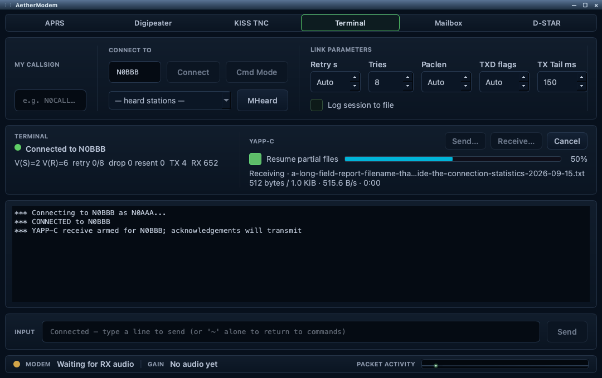

# YAPP-C file transfers in AetherModem Terminal

Status: implementation authorized by the acting maintainer in the task; RFC waived.
Local implementation built and tested; independent interoperability and
live-radio tests remain separate validation requirements.
Source baseline: `c7c6fde3` (2026-09-14).

## Scope and operator workflow

Add single-file send and receive to the existing TERMINAL status group, above
the transcript. Connection state and link statistics stay on the left; a compact
YAPP-C panel occupies the right. Its controls share the heading row, with a slim
progress bar and separate percentage below. Two bounded status lines elide long
filenames/errors; hover text and the accessible description retain the full text.
Preserve the existing connection controls.

- **Send…** chooses a local file and starts a YAPP-C transfer on the current
  connected AX.25 session. It does not dial a different station.
- **Receive…** selects a destination directory and arms reception for the current
  peer. Explain that receiving transmits protocol acknowledgements. Receiving is
  explicitly armed per transfer; unsolicited headers never create files.
- **Cancel** appears during an armed or active transfer. Disconnection, modem
  shutdown, radio/session changes and window closure terminate the transfer too.
- Show filename, direction, phase, bytes/total, progress, elapsed time, useful
  bytes/second and an estimate of remaining time in the status group. Delay ETA
  until meaningful progress exists; show waiting/busy explicitly.
- During transfer ownership, disable ordinary text sending and settings that
  would change the connection or modem profile. Keep cancellation/disconnect
  available. Enforce the same exclusion in the controller, not only the UI.
- Print start, resume, completion, cancellation and failure summaries into the
  transcript and its existing session log. Never print binary payload bytes.
  A successful receive includes the actual saved path. Summaries distinguish
  original file size, resumed offset, newly transferred bytes, elapsed time,
  useful throughput, and the AX.25 retry/timeout counter deltas for this transfer.

Example transcript (illustrative numbers):

```text
*** YAPP-C receiving report.txt from N0CALL-1 — 12,288 bytes
*** Resuming at byte 4,096; 8,192 bytes remaining
*** Received report.txt — 12,288 bytes; 8,192 new in 04:12 (32.5 B/s)
*** AX.25: 3 retransmissions, 1 timeout. Saved: <destination>/report.txt
```



Preview from the offline UX harness: injected transfer data, no radio connected.

## Protocol authority and compatibility

Implement from the published [WA7MBL YAPP 1.1 specification and FC1EBN
YAPP-C extensions](https://www.ir3ip.net/iw3fqg/doc/yapp.htm).
YAPP-C negotiates an eight-bit additive checksum on each data block and supports
a receiver-selected restart offset. This is not a cryptographic file-integrity
proof. A checksum error cancels the transfer under the specified state machine;
do not invent per-block YAPP retransmission above AX.25.

First delivery requires checksum mode. If a peer selects plain YAPP, explain
the incompatibility and stop; optional plain-YAPP support can be considered
separately. Include extended DOS date/time metadata and checksum-mode resume.
Support arbitrary binary bytes, fragmented/coalesced protocol input, the special
256-byte data length encoding, cancellation and EOF/EOT acknowledgements.
Single-file operation is deliberate: no batch sending, remote wildcard requests
or automatic mailbox service in this milestone.

## Reusable implementation

1. **YappTransferSession**, under `src/core/tnc/`: a Qt Core protocol state
   machine with byte input/output, explicit send/receive/cancel entry points,
   progress and structured terminal results. No widgets, radio-family checks,
   sockets or new worker thread. Keep protocol parsing distinct from storage
   policy; tests inject protocol bytes and use temporary files without a radio peer.
2. **Transfer storage helper**: owns local file selection, safe partial-file
   handling and resume metadata. Future mailbox code supplies its own directory,
   quota and admission policy while reusing the same session engine.
3. **TncTerminal**: owns the active transfer and routes raw `onLinkData()` bytes
   to it before the existing Latin-1/newline conversion. Own the connected stream
   exclusively until completion/cancellation is settled. Do not broadcast the
   same bytes to a text client and the transfer engine. Preserve trailing input
   deliberately when handing the stream back to the terminal.
4. **Ax25Connection**: keep the existing link implementation unchanged. A 50 ms
   terminal-owned timer pulls one protocol packet only after the previous AX.25
   bytes are acknowledged (`sendQueueBytes() == 0` and `unacked() == 0`). This
   bounds the producer to one packet (259 bytes including YAPP-C framing) without
   introducing new reentrant link callbacks or changing retry policy. The public
   engine pull API can also serve a future mailbox-owned transport adapter.
5. **Terminal UI**: file pickers and progress consume the controller API. Follow
   current theme, accessibility, dialog and automation-bridge conventions. Send,
   Receive and graceful Cancel require bridge TX authorization because all three
   can cause emissions. Read-only transfer status should be available through the existing
   terminal snapshot. Add narrowly scoped automation actions only if existing
   widget actions cannot exercise the file-picker workflow deterministically.

## Resume and storage correctness

- Preserve checked, successfully written partial data on interruption using an
  application-owned partial file plus atomically written versioned metadata.
- Match peer, remote basename, announced size and timestamp before offering
  resume. Validate the local partial length and checksum of the locally saved
  prefix; local metadata is not proof that the remote prefix is identical.
- If identity metadata is absent or differs, require a fresh transfer. Never
  append to an arbitrary existing file merely because its name matches.
- Validate every requested offset against the actual source size and negotiated
  metadata. Resume requires a new operator action; no automatic reconnect/TX.
- Refuse unsafe names, path traversal, invalid numeric fields, oversized headers,
  excess data, unavailable storage and short writes. Bound buffers independently
  of the advertised file size. Use explicit receive size limits and check disk
  space without treating the check as a guarantee that subsequent writes succeed.
- Publish the completed file only after expected length and all block checks
  pass, with checked flush/close and a same-directory atomic rename. Do not
  overwrite an existing destination silently. Keep partial data on finalization
  failure and report the failure instead of acknowledging successful storage.
- Distinguish file acceptance from session completion: EOF confirms the file;
  EOT completes the session. Lost final confirmation must not be reported as
  unqualified sender success or cause duplicate receive output.
- Cancellation needs bounded latency: stop generating data immediately, resolve
  already accepted AX.25 bytes in sequence, and bound the cancel handshake.
  Do not discard unacknowledged frames and break AX.25 sequence state. On forced
  termination, invalidate transfer-owned pending RF work without clearing other
  services' packets; queue ownership needs an explicit implementation audit.

## HF/VHF and Flex/Icom integration

Current source establishes:

- `TncTerminal` and `PmsMailbox` each use `Ax25Connection` independently.
- Terminal frames enter `m_digi->enqueue()` in
  `Ax25HfPacketDecodeDialog.cpp`, sharing the existing serialized RF path.
- AX.25 derives its timers and packet length from `LinkTimingProfile`; window
  size defaults to one because each frame uses a separate half-duplex keyup.
- The dialog has radio-confirmed PTT waiting for Icom, finite audio completion
  handling, and queued delivery to `AudioEngine::sendModemTxAudio()`.

Thus YAPP-C can be radio-independent above AX.25, but AX.25 does not establish
correct RF audio routing, PTT confirmation, drain/unkey timing or RX recovery.
Before implementation is considered verified, trace those paths through the
current Flex and Icom backends separately, including attached slice/session
ownership and interference from PMS/KISS/digipeater work sharing the queue.
No new raw radio commands or family-specific branches belong in the transfer
engine. Consult the local radio references before backend changes or simulation.

Transfer inactivity deadlines must accommodate the selected air-interface
timing, queue residence, half-duplex turnaround, peer busy and bounded AX.25
retry budget. Never use a short fixed VHF timeout for HF. Do not accelerate
MAXFRAME or change modem defaults as part of this feature.

## Validation and delivery

1. Socket-free protocol vectors: every byte value, every fragmentation boundary,
   zero-length file, 256-byte block, invalid checksum/length/header/state,
   resume negotiation and rejected offsets, short writes, disconnection,
   cancellation, stalled/peer-busy link, and final acknowledgement loss.
2. Injected AX.25 integration: sequence wrap, retransmission/duplicate input,
   bounded producer queue, HF/VHF timing, no binary-to-transcript conversion,
   and exclusive stream ownership. No default fake-radio socket test.
3. Current-change app build, relevant headless tests, static checks and bridge
   inspection of controls, states and transcript results. Visual inspection of
   the actual TERMINAL group remains necessary for placement acceptance.
4. Independent YAPP-C implementation interoperability: send, receive, interrupt,
   restart application, resume and compare complete file hashes. Our own paired
   engines alone do not establish interoperability.
5. Separately authorized live Flex and Icom trials using supported HF/VHF setups;
   verify availability/locks and TX safety first. Include PTT/audio start and
   drain, unkey, resumed RX, cancellation, link loss and busy-radio behavior.

Recommended first milestone: Terminal single-file YAPP-C plus conservative
resume, telemetry and reusable core. Defer mailbox commands, unattended receive,
compression, batching, automatic reconnect and private hash extensions until
independent interoperability and both radio paths are proven.

The acting maintainer explicitly approved implementation without an RFC in the
2026-09-15 task continuation. This is task-specific authorization; repository
policy files are unchanged. No GitHub issue or PR has been published.

## Current implementation choices

- Maximum file size is 64 MiB; portable ASCII filenames are limited to 120
  characters. Existing final files are never silently overwritten.
- Receive requires the YAPP-C timestamp header. Only timestamp/peer/name/size
  matching partials with a verified local SHA-256 checkpoint can resume. This
  does not prove the remote prefix is unchanged; no private protocol extensions
  are introduced. An incompatible checkpoint is refused with a visible reason.
- Settings are session-local. The Resume checkbox starts checked; receive is
  never automatically armed or restored after an app restart.
- Cancellation/failure closes the terminal connection after the bounded CAN
  handshake. An unstarted receive cancels immediately. Disconnect/modem disable,
  slice change and radio loss invalidate terminal-owned queued RF frames and
  terminate transfer state. A successful transfer preserves the connection and
  up to 4 KiB of a coalesced post-transfer text prompt.
- The progress byte count on send means bytes supplied to the connected link.
  Success requires EOF and EOT acknowledgements; queued bytes alone never prove
  remote acceptance. Receive publishes the checked file before ACK-EOF and
  separately reports a missing session-end confirmation.
- Application inactivity is bounded by the larger of three minutes or twice the
  configured AX.25 T1 retry budget. No automatic reconnect/resume is initiated.


## Local validation (2026-09-15)

At commit `c7c6fde3`, working tree modified:

- macOS app build passed with `cmake --build build -j22 --target AetherSDR`.
- Headless CTest selection passed 6/6: `yapp_transfer_test`,
  `tnc_terminal_test`, `aprs_digipeater_model_test`, `ax25_link_timing_test`,
  `icom_ptt_authority_test`, `icom_audio_test`.
- Protocol tests cover published handshake/checksum/resume vectors, all 256 byte
  values, every split boundary of a maximum block, coalesced frames, empty files,
  invalid checksums/offsets/states/names, source changes, checkpoint tampering,
  metadata-write failure and lost final confirmation.
- Terminal integration injects AX.25 frames under HF and VHF timing profiles:
  send and receive, packet segmentation/sequence wrap, exact binary CR/LF,
  exclusion of typed text, final acknowledgement gating, transcript statistics,
  bounded stalled production, reset invalidation and no late packets.
- Bridge inspection of the freshly built, isolated, TX-disabled process verified
  the TERMINAL group's controls, keying markers, default resume state, progress
  and read-only transfer snapshot. Send/Receive were refused while disconnected.
  A 1080x680 offscreen widget capture was inspected; no clipping was seen.
- Strict engine boundary, command plane, capability freeze, test registration,
  frozen CI gate and bridge-document checks passed. Accessibility scan reported
  only the pre-existing `m_txText` disabled-description warning.
- Local proof artifacts are under `build/yapp-proof/` (not versioned).

The normal sandbox build could not run macOS icon generation; the build succeeded
outside that sandbox. No backend code, radio defaults or RF commands changed.
This development build used the local optional dependencies detected by CMake;
QtKeychain and DFNR were unavailable. It is not a packaged release artifact.
Independent peer interoperability, native-display/screen-reader acceptance,
hosted CI and live Flex/Icom RF transfer tests have not been run.

### Terminal layout validation

The automation bridge exercised the TX-disabled app at 1080×680, 1280×800 and
1600×900: the YAPP panel remained to the right of the link statistics, the progress
bar stayed 10 px high, and Resume toggled correctly. Send, Receive and Cancel
retained their keying markers and were disabled without a connected radio/peer.
An offline harness linked the actual dialog and controller with null radio/audio
backends and injected AX.25/YAPP-C bytes. It checked armed, 50% and completed
100% states with a long filename, including completion statistics in the transcript.
These are local UX/state checks, not live-radio or third-party interoperability
evidence. The six focused protocol/routing suites passed on the modified tree.
